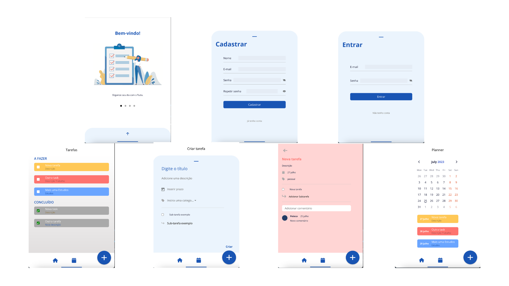

</p>
<h4 align="center"> 
	Tudu App
</h4>

<p align="center">
	
</p>

<p align="center">
 <a href="#-sobre-o-projeto">Sobre</a> •
 <a href="#-funcionalidades">Funcionalidades</a> •
 <a href="#-layout">Layout</a> • 
 <a href="#-como-executar-o-projeto">Como executar</a> • 
 <a href="#-tecnologias">Tecnologias</a> • 
 <a href="#-autora">Autora</a> • 
 <a href="#user-content--licença">Licença</a>
</p>

<br>

## 💻 Sobre o projeto
O Tudu App é um aplicativo de tarefas que facilita o seu dia-a-dia, pois ajuda no gerenciamento de tarefas do trabalho, pessoais e de estudos. <br>
Organize sua rotina com o Tudu.

<br>

---

## ⚙️ Funcionalidades

- Autenticação de usuários (permite que o usuário crie uma conta e faça login);

- Gestão de Tarefas (permite que o usuário crie, visualize e conclua tarefas);

- Criação de Subtarefas (permite a criação de subtarefas);

- Comentários nas tarefas (permite que o usuário adicione comentários em tarefas);

- Visualização de lista de tarefas a fazer e concluídas;

- Calendário para auxílio na projeção de tarefas.

---

<br>

## Layout

<br>
  

<br>

---
## 🛣️ Como executar o projeto

Esse App precisa de alguns pré-requisitos para funcionar.

### Pré-requisitos

Antes de começar, você vai precisar ter instalado em sua máquina as seguintes ferramentas:
[Git](https://git-scm.com), [Node.js](https://nodejs.org/en/).
Além disto é bom ter uma IDE para trabalhar com o código como [VSCode](https://code.visualstudio.com/)

#### 🎲 Rodando o app Tudu

```zsh

# Clone este repositório
$ git clone git@github.com:DayArnaud/tudu-app.git

# Acesse a pasta do projeto no terminal/cmd
$ cd tudu-app

# Instale as dependências
$ npm install

# Execute a aplicação em modo de desenvolvimento
$ npm run dev

# O app inciará na porta:4200 - acesse http://localhost:4200 

## Obs:
O app vai precisar de uma API para funcionar perfeitamente, acesse este repositório:
```
<a href="https://github.com/DayArnaud/tudu-api">Clique para acessar</a>


---

## 🛠 Tecnologias

As seguintes ferramentas foram usadas na construção do projeto:

#### []()**Api**  ([NodeJS](https://nodejs.org/en/)  +  [TypeScript](https://www.typescriptlang.org/) + [Angular](https://www.angular.org/))

-   **[Angular](https://angular.org/)**
-   **[Typescript](https://typescriptlang.org)**
-   **[Angular Material](https://material.angular.io/)**
-   **[Taiga-UI](https://taiga-ui.dev/)**

> Veja o arquivo  [package.json](https://github.com/DayArnaud/tudu-app/blob/master/package.json)

---

<br>

## 🧙‍♀️ Autora

<a href="https://www.linkedin.com/in/dayane-arnaud/">
 
 <br />
 <sub><b>Dayane Arnaud</b></sub></a>✨</a>
 <br />

---

## 📝 Licença

<!-- Este projeto esta sobe a licença [MIT](./LICENSE). -->

Feito com ❤️ por Dayane Arnaud [Entre em contato!](https://wa.me/5548999932109)
